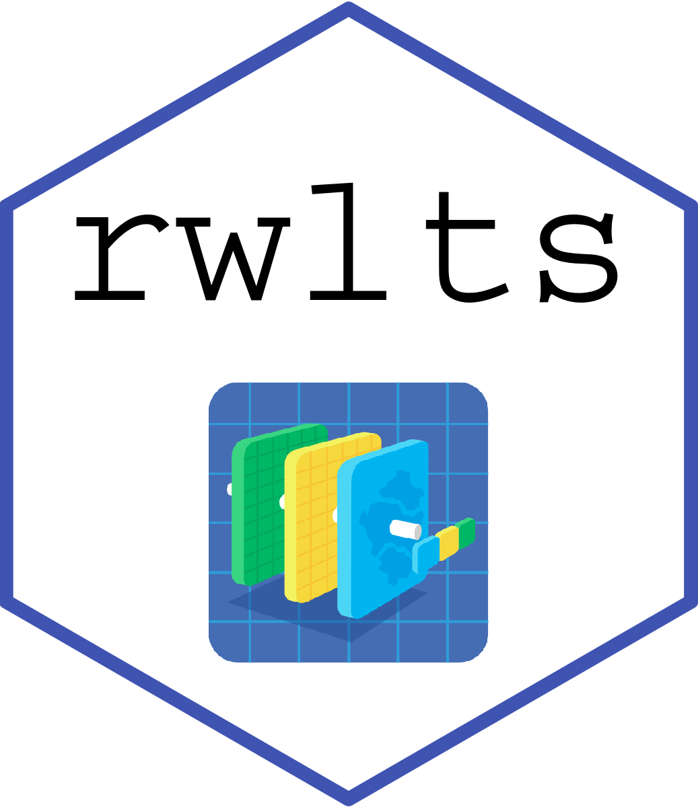
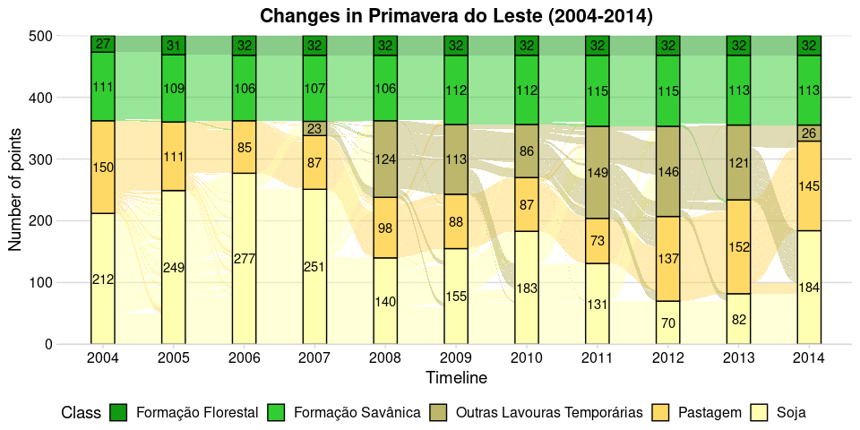

<!-- README.md is generated from README.Rmd. Please edit that file -->

# rwlts 

R Client Library for Web Land Trajectory Service (WLTS)

<!-- badges: start -->

[](https://github.com/brazil-data-cube/rstac/blob/master/LICENSE)
[](https://drone.dpi.inpe.br/brazil-data-cube/rwlts)
[](https://codecov.io/gh/brazil-data-cube/rwlts)
[](https://lifecycle.r-lib.org/articles/stages.html)
[](https://discord.com/channels/689541907621085198#)
<!-- badges: end -->

# About

Information on Land Use and Land Cover (LULC) is essential to support
governments in making decisions about the impact of human activities on
the environment, planning the use of natural resources, conserving
biodiversity and monitoring climate change.

Currently, several projects systematically provide information on the
dynamics of land use and cover. Well known projects include PRODES,
DETER and TerraClass. These projects are developed by INPE and they
produce information on land use and coverage used by the Brazilian
Government to make public policy decisions. Besides these projects there
are other initiatives from universities and space agencies devoted to
the creation of national and global maps.

Although these projects follow open data policies and provide a rich
collection of data, there is still a gap in tools that facilitate the
integrated use of these collections. Each project adopts its own land
use and land cover classification system, providing different class
names and meanings for the elements of these collections. The forms of
distribution of project data can be carried out in different ways,
through files or web services. In addition, the data has different
spatial and temporal resolutions and storage systems (raster or vector).

In this context, the **W**eb **L**and **T**rajectory **S**ervice (WLTS)
is a service that aims to facilitate the access to these vaapproach
consists of using a data model that defines a minimum set of temporal
and spatial information to represent different sources and types of
data, but with a focus on land use and land cover.

WLTS can be used in a variety of applications, such as validating land
cover data sets, selecting training samples to support Machine Learning
algorithms used in the generation of new classification maps.

If you want to know more about WLTS service, please, take a look at its
[specification](https://github.com/brazil-data-cube/wlts-spec).

## Installation

To install the development version of `rwlts`, run the following
commands:

``` r
# load necessary libraries
library(devtools)
devtools::install_github("brazil-data-cube/rwlts")
```

Importing `rwlts` package:

``` r
library(rwlts)
```

## Usage

`rwlts` implements the following WLTS operations:

| **WLTS** operations     | `rwlts` functions                          |
|:------------------------|:-------------------------------------------|
| `/list_collections`     | `list_collections(URL,)`                   |
| `/describe_collections` | `describe_collection(URL, collection_id)`  |
| `/trajectory`           | `get_trajectory(URL, latitude, longitude)` |

These functions can be used to retrieve information from a WLTS API
service. The code bellow creates a `wlts` object and list the available
collections of the WLTS API of the Brazil Data Cube project of the
Brazilian National Institute for Space Research INPE.

### List Collections

The first operation, `list_collections`, retrieves all available
collections in WLTS service.

``` r
wlts_bdc <- "https://brazildatacube.dpi.inpe.br/wlts/"

list_collections(wlts_bdc)
#>  [1] "terraclass_amazonia"       "deter_amazonia_legal"     
#>  [3] "deter_cerrado"             "prodes_cerrado"           
#>  [5] "prodes_amazonia_legal"     "ibge_cobertura_uso_terra" 
#>  [7] "lapig_areas_pastagem"      "mapbiomas5_amazonia"      
#>  [9] "mapbiomas5_cerrado"        "mapbiomas5_caatinga"      
#> [11] "mapbiomas5_mata_atlantica" "mapbiomas5_pampa"         
#> [13] "mapbiomas5_pantanal"
```

### Describle Collection

Each collection returned by the WLTS service can be used for retrieving
LULC trajectories. To get information about the collections, we use the
`describe_collection` function. This function returns the metadata of a
given collection, which includes the description and specific details.
The metadata also describes the spatio-temporal extent of the
collection.

In the code below, we retrieve the metadata from the
`deter_amazonia_legal` collection using the `describe_collection`
function.

``` r
describe_collection(wlts_bdc, "deter_amazonia_legal")
#> $classification_system
#> $classification_system$classification_system_id
#> [1] "21"
#> 
#> $classification_system$classification_system_name
#> [1] "DETER Amazônia Legal"
#> 
#> $classification_system$classification_system_version
#> [1] "1.0"
#> 
#> $classification_system$type
#> [1] "Self"
#> 
#> 
#> $collection_type
#> [1] "Feature"
#> 
#> $description
#> [1] "Alertas de Desmatamento da Amazônia Legal."
#> 
#> $detail
#> [1] "O DETER é um levantamento rápido de alertas de evidências de alteração da cobertura florestal na Amazônia, feito pelo INPE. O DETER foi desenvolvido como um sistema de alerta para dar suporte à fiscalização e controle de desmatamento e da degradação florestal realizadas pelo Instituto Brasileiro do Meio Ambiente e dos Recursos Naturais Renováveis (IBAMA) e demais órgãos ligados a esta temática. Mais informações acesse: http://www.obt.inpe.br/OBT/assuntos/programas/amazonia/deter"
#> 
#> $name
#> [1] "deter_amazonia_legal"
#> 
#> $period
#> $period$end_date
#> [1] "2020-06-18"
#> 
#> $period$start_date
#> [1] "2016-08-02"
#> 
#> 
#> $resolution_unit
#> $resolution_unit$unit
#> [1] "DAY"
#> 
#> $resolution_unit$value
#> [1] 1
#> 
#> 
#> $spatial_extent
#> $spatial_extent$xmax
#> [1] -44.00039
#> 
#> $spatial_extent$xmin
#> [1] -73.54909
#> 
#> $spatial_extent$ymax
#> [1] 4.555376
#> 
#> $spatial_extent$ymin
#> [1] -18.03644
```

### Trajectory

LULC trajectories can be extracted from collections. These LULC
trajectories in WLTS services are associated with a point (lat, long) in
geographic space. In `rwlts`, we can use the `get_trajectory` function
to retrieve trajectories. For example, in the code below, the point
`(-54, -12)` trajectory is retrieved from the `mapbiomas5_amazonia`
collection.

``` r
get_trajectory(wlts_bdc, 
               latitude = -12, 
               longitude = -54, 
               collections = "mapbiomas5_amazonia")
#> $query
#> NULL
#> 
#> $result
#> # A tibble: 20 x 4
#>    class              collection          date  point_id
#>    <chr>              <chr>               <chr>    <int>
#>  1 Formação Florestal mapbiomas5_amazonia 2000         1
#>  2 Formação Florestal mapbiomas5_amazonia 2001         1
#>  3 Formação Florestal mapbiomas5_amazonia 2002         1
#>  4 Formação Florestal mapbiomas5_amazonia 2003         1
#>  5 Formação Florestal mapbiomas5_amazonia 2004         1
#>  6 Formação Florestal mapbiomas5_amazonia 2005         1
#>  7 Formação Florestal mapbiomas5_amazonia 2006         1
#>  8 Formação Florestal mapbiomas5_amazonia 2007         1
#>  9 Formação Florestal mapbiomas5_amazonia 2008         1
#> 10 Formação Florestal mapbiomas5_amazonia 2009         1
#> 11 Formação Florestal mapbiomas5_amazonia 2010         1
#> 12 Formação Florestal mapbiomas5_amazonia 2011         1
#> 13 Formação Florestal mapbiomas5_amazonia 2012         1
#> 14 Formação Florestal mapbiomas5_amazonia 2013         1
#> 15 Formação Florestal mapbiomas5_amazonia 2014         1
#> 16 Formação Florestal mapbiomas5_amazonia 2015         1
#> 17 Formação Florestal mapbiomas5_amazonia 2016         1
#> 18 Formação Florestal mapbiomas5_amazonia 2017         1
#> 19 Formação Florestal mapbiomas5_amazonia 2018         1
#> 20 Formação Florestal mapbiomas5_amazonia 2019         1
#> 
#> attr(,"class")
#> [1] "wlts"
```

The `get_trajectory` function returns a `list` of class `wlts`. This
object contains the `query` and `result` attributes. The `query`
attribute stores the query performed to retrieve the data. By default,
it will be `NULL`. For this information to be stored, the
`query_info = TRUE` parameter is required. For example:

``` r
get_trajectory(wlts_bdc, 
               latitude = -12, 
               longitude = -54, 
               collections = "mapbiomas5_amazonia", 
               query_info = TRUE)
```

The `result` attribute stores the retrieved trajectories. The data is
stored in a `tibble` for easy manipulation, which has the columns:

-   `class`: LULC class;
-   `collection`: Data Collection;
-   `date`: Time instants of the trajectory;
-   `point_id`: ID of the point that was queried.

The `point_id` column of the result `tibble` is used in `rwlts` to
identify the entry point. This ID is necessary since the
`get_trajectory` function can be used with vectors as input. For
example, the code below retrieves the trajectory of data from the
`mapbiomas5_amazonia` collection for two points `(-54, -12)` and
`(-54, -11.01)`.

``` r
get_trajectory(wlts_bdc, 
               latitude = c(-12, -11.01), 
               longitude = c(-54, -54), 
               collections = "mapbiomas5_amazonia")
#> $query
#> NULL
#> 
#> $result
#> # A tibble: 40 x 4
#>    class              collection          date  point_id
#>    <chr>              <chr>               <chr>    <int>
#>  1 Formação Florestal mapbiomas5_amazonia 2000         1
#>  2 Formação Florestal mapbiomas5_amazonia 2001         1
#>  3 Formação Florestal mapbiomas5_amazonia 2002         1
#>  4 Formação Florestal mapbiomas5_amazonia 2003         1
#>  5 Formação Florestal mapbiomas5_amazonia 2004         1
#>  6 Formação Florestal mapbiomas5_amazonia 2005         1
#>  7 Formação Florestal mapbiomas5_amazonia 2006         1
#>  8 Formação Florestal mapbiomas5_amazonia 2007         1
#>  9 Formação Florestal mapbiomas5_amazonia 2008         1
#> 10 Formação Florestal mapbiomas5_amazonia 2009         1
#> # … with 30 more rows
#> 
#> attr(,"class")
#> [1] "wlts"
```

In this case, the point `(-54, -12)` will have `point_id` equal to 1,
while `(-54, -11.01)` will have `point_id` equal to 2.

In addition to multiple point retrieval, the `get_trajectory` function
allows multiple collections to be queried for the composition of the
trajectory. To do this, in the `collections` parameter, the collections
must be assigned. For example, data from the collections
`mapbiomas5_amazonia` and `terraclass_amazonia` are retrieved in the
code below.

``` r
get_trajectory(wlts_bdc, 
               latitude = c(-12, -11.01), 
               longitude = c(-54, -54), 
               collections = "mapbiomas5_amazonia,terraclass_amazonia")
#> $query
#> NULL
#> 
#> $result
#> # A tibble: 50 x 4
#>    class              collection          date  point_id
#>    <chr>              <chr>               <chr>    <int>
#>  1 Formação Florestal mapbiomas5_amazonia 2000         1
#>  2 Formação Florestal mapbiomas5_amazonia 2001         1
#>  3 Formação Florestal mapbiomas5_amazonia 2002         1
#>  4 Formação Florestal mapbiomas5_amazonia 2003         1
#>  5 Formação Florestal mapbiomas5_amazonia 2004         1
#>  6 Floresta           terraclass_amazonia 2004         1
#>  7 Formação Florestal mapbiomas5_amazonia 2005         1
#>  8 Formação Florestal mapbiomas5_amazonia 2006         1
#>  9 Formação Florestal mapbiomas5_amazonia 2007         1
#> 10 Formação Florestal mapbiomas5_amazonia 2008         1
#> # … with 40 more rows
#> 
#> attr(,"class")
#> [1] "wlts"
```

Finally, the `get_trajectory` function, through the `start_date` and
`end_date` parameters, allows you to specify the time intervals used in
the trajectory. To exemplify its use, in the code below, trajectories
are retrieved for the points `(-54, -12)` and `(-54, -11.01)`, from the
`mapbiomas5_amazonia` and `terraclass_amazonia` collections in the time
interval `[2003-01-01, 2004-01-01]`.

``` r
get_trajectory(wlts_bdc, 
               latitude = c(-12, -11.01), 
               longitude = c(-54, -54), 
               start_date = "2003-01-01",
               end_date = "2004-01-01",
               collections = "mapbiomas5_amazonia,terraclass_amazonia")
#> $query
#> NULL
#> 
#> $result
#> # A tibble: 6 x 4
#>   class              collection          date  point_id
#>   <chr>              <chr>               <chr>    <int>
#> 1 Formação Florestal mapbiomas5_amazonia 2003         1
#> 2 Formação Florestal mapbiomas5_amazonia 2004         1
#> 3 Floresta           terraclass_amazonia 2004         1
#> 4 Formação Florestal mapbiomas5_amazonia 2003         2
#> 5 Formação Florestal mapbiomas5_amazonia 2004         2
#> 6 Floresta           terraclass_amazonia 2004         2
#> 
#> attr(,"class")
#> [1] "wlts"
```

The `rwlts` uses the **httr** package to manage HTTP requests, allowing
the use of tokens from the authorization protocols OAuth 1.0 or 2.0 as
well as other configuration options. In the code below, we present an
example of how to provide a parameter token on a HTTP request.

``` r
my_token <- "..."

get_trajectory(wlts_bdc, 
               latitude = c(-12, -11.01), 
               longitude = c(-54, -54), 
               collections = "mapbiomas5_amazonia,terraclass_amazonia",
               config = httr::add_headers("x-api-key" = my_token))
```

### Sankey plot

To visualize the trajectories and fully understand their time dynamics,
the `rwlts` package implements the Sankey-based visualization method. To
create this plot, use the `plot_sankey` function, as shown in the
example below:

``` r
# import data from package
data("mt_500_mapbiomas_cerrado")

plot_sankey(mt_500_mapbiomas_cerrado)
```



Besides, you can fully customize the returned plot. This customization
is possible since the `plot_sankey` function returns a ggplot2 object.

``` r
library(ggplot2)
library(ggalluvial) # use to create plot
library(cowplot)    # use different theme

plot_sankey(mt_500_mapbiomas_cerrado, show_count_transition = TRUE) + 
  cowplot::theme_minimal_hgrid() + 
  labs(title = "Changes in Primavera do Leste (2004-2014)",
       x = "Timeline",
       y = "Number of points",
       fill = "Class") + 
  theme(legend.position = "bottom",
        plot.title = element_text(hjust = 0.5)) + 
  scale_fill_manual(values = c("#129912",
                               "#32CD32",
                               "#BDB76B",
                               "#FFD966",
                               "#FFFFB2"),
                    labels = c("Formação Florestal",
                               "Formação Savânica",
                               "Outras Lavouras Temporárias",
                               "Pastagem",
                               "Soja"))
```


> The numbers inside each bar correspond to the quantity of points
> extracted in each year. You can see that according to the change of
> LULC classes, the quantity of points in each class also changes.

# License

Copyright (C) 2021 INPE.

R client for WLTS is free software; you can redistribute it and/or
modify it under the terms of the MIT License; see LICENSE file for more
details.
